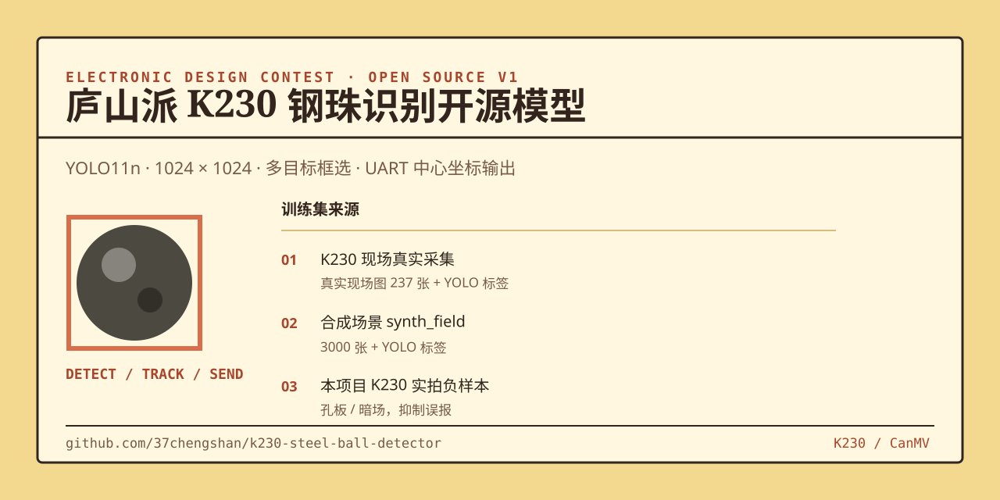

# 电赛 · 庐山派 K230 钢珠识别开源模型



面向 **标准庐山派 K230 + CanMV v1.6** 的钢珠检测训练与部署工程。模型会识别画面中的每颗钢珠；K230 端脚本绘制检测框，并经 UART1 输出钢珠中心坐标。

> 当前推荐版本是 **YOLO26n 第 19 轮、416×416 I16W8 量化 KModel**。原始无叠框画面的 7 颗钢珠在 416 ONNX 下能正确输出 7 个检测；U8 激活量化会明显抬高背景分数，因此改用 int16 激活保留中间特征精度。

## 当前推荐版本

- KModel：`models/steel_ball_yolo26n_epoch19_416_i16w8.kmodel`
- CanMV 脚本：`canmv/steel_ball_yolo26_uart_epoch19.py`
- 输入：`uint8 NCHW [1,3,416,416]`，编译器内执行 `/255`
- 输出：`[1,300,6]`，每行为 `[x1,y1,x2,y2,confidence,class_id]`
- 量化：103 张正负样本校准，`int16` 激活、`uint8` 权重，文件约 3.3 MB
- 原始候选阈值 `0.15`，显示阈值 `0.30`；中等分数需连续 3 帧，高分目标需连续 2 帧
- 显示框使用坐标和置信度 EMA 平滑，并拒绝宽扁、超大和面积异常的候选框
- 终端每 30 帧打印最高分数及 `0.05/0.10/0.20/0.30` 四档候选数，便于区分模型无输出和阈值过滤
- 首帧额外打印 `KPU_RUN_BEGIN/KPU_RUN_END`；如果没有 `KPU_RUN_END`，说明仍是运行时兼容问题而不是识别率问题

### dataset_70816 召回优化候选

针对同一台 CanMV-K230-v1.1 实机新增的 370 张 `512x288` 钢珠图片，已生成与板端 AI2D 直接拉伸预处理一致的候选版本：

- KModel：`models/steel_ball_dataset_70816_yolo26n_416_stretched_recall_i16w8.kmodel`
- CanMV 入口：`canmv/steel_ball_dataset_70816_yolo26_uart.py`
- 独立测试集：56 张，未参与训练、验证或 PTQ 校准
- `confidence=0.20` 时 ONNX 与 KModel 均为 TP=56、FN=0、FP=5
- 输入 `uint8 NCHW [1,3,416,416]`，输出 `[1,300,6]`
- 该版本优先解决漏检，板端参数改为两帧确认和最小边长 8 像素；完成实机复测前保留上面的 epoch19 版本作为回退
- 当前入口启用了常速度卡尔曼跟踪：快速运动使用预测中心匹配，已确认目标最多连续预测 4 帧维持轨迹（coast 期间不发送坐标，改发丢失帧 `AA 55 FF FE FF FE 0D 0A`）；必须同时复制更新后的 `canmv/steel_ball_yolo26_uart_epoch19.py`

训练在第 20 轮开始后手动暂停，当前交付权重来自最后完成验证的第 19 轮：

| Precision | Recall | mAP50 | mAP50-95 |
| ---: | ---: | ---: | ---: |
| 0.99028 | 0.97215 | 0.99252 | 0.94404 |

## 历史候选与已知问题

- `models/steel_ball_reference_yolo11n_1024_uint8.kmodel`（v1）在 CanMV 上出现了满屏假框，**不要用于验证**。
- `candidates/v2_raw_graph_f32/` 的 K230 画面仍出现满屏假框，**不要将它用于实际识别**。该候选版的转换参数把模型声明为浮点输入，但板端预处理仍输出 `uint8` 图像，输入契约不匹配。
- 该目录的脚本现已加入原始 KPU 张量诊断。运行一次后，它会打印输出形状、数据类型、最大分数和超过 0.20 的候选数，用于确定 v1 的剩余问题是否为 PTQ 输出量化。
- `candidates/v4_target_pipeline_ptq/` 保留用于复现 1024 PTQ 的异常输出，**不要用于实际识别**。
- `candidates/v5_416_proven_path/` 是历史 YOLO11 候选，匹配 416 输入和 512×288 摄像头通道的已验证路径。
- `candidates/v6_416_w16/` 在 v5 的已验证路径上提高权重量化精度，用于减少 K230 量化引入的额外误报。

## 本次发布

| 文件 | 说明 |
| --- | --- |
| `models/steel_ball_yolo26n_epoch19_best.pt` | 当前 YOLO26n 第 19 轮 PyTorch 最佳权重 |
| `models/steel_ball_yolo26n_epoch19_416_i16w8.kmodel` | 当前推荐的 K230 I16W8 量化 KModel |
| `models/steel_ball_yolo26n_epoch19_416_i16w8.conversion.json` | 103 张校准样本和转换哈希记录 |
| `models/steel_ball_yolo26n_epoch19_416_u8w16.kmodel` | 可运行但背景分数明显升高，保留作问题复现 |
| `models/steel_ball_yolo26n_epoch19_1024.onnx` | 1024×1024、opset 13 端到端 ONNX |
| `models/steel_ball_yolo26n_epoch19_1024_fp32.kmodel` | 实机首次 KPU 推理不返回，**不要部署** |
| `models/steel_ball_yolo26n_epoch19_416.onnx` | 416×416、opset 13、端到端输出 ONNX |
| `models/steel_ball_yolo26n_epoch19_416_fp32.kmodel` | FP32 诊断文件，实机可能停在首次推理，**不要部署** |
| `canmv/steel_ball_yolo26_uart_epoch19.py` | 当前推荐的 CanMV v1.6 检测、诊断与 UART 脚本 |
| `docs/yolo26_epoch19_1024_validation.json` | 1024 版本三张真实图的一致性验证报告 |
| `models/yolo11n.pt` | Ultralytics YOLO11n 原始预训练权重 |
| `models/steel_ball_reference_yolo11n_1024_best.pt` | 1024×1024 钢珠检测训练最佳权重 |
| `models/steel_ball_reference_yolo11n_1024_uint8.kmodel` | v1 KModel，保留仅用于问题复现，**不要部署** |
| `candidates/v2_raw_graph_f32/` | 修复输入归一化后的 K230 候选模型、脚本和量化记录 |
| `canmv/steel_ball_yolo11_uart.py` | CanMV K230 运行、框选、平滑追踪与 UART 上报脚本 |
| `training/scripts/` | 数据清单构建、训练、ONNX 导出、训练看板脚本 |
| `training/data/k230_hard_examples/` | K230 实拍的孔板、暗场两个空标签负样本 |

旧 YOLO11 高清训练在完成第 40 轮后手动早停，验证集最佳 **mAP50-95 = 0.96108**；该成绩保留作历史对照，不代表旧 KModel 的板端输出正确。当前部署改用上面的 YOLO26 第 19 轮版本。

## 训练数据

本训练不上传原始大数据集。数据构成、数量与用途均在此明确列出：

| 数据 | 内容 | 用途 |
| --- | --- | --- |
| `real_field_sample` | 237 张真实现场图及 YOLO 标签 | 训练、验证、真实现场测试 |
| `synth_field` | 3000 张 copy-paste 合成现场图及 YOLO 标签 | 训练、验证 |
| K230 实拍负样本 | 孔板、暗场共 2 张空标签负样本 | 抑制孔板/暗场误报 |
| K230 实拍序列 | `dataset_70596` / `dataset_70816`（见 `training/scripts/`） | 迭代训练与独立测试 |

## 训练

准备 Python、PyTorch 和 Ultralytics 后，在仓库根目录执行：

```powershell
python training/scripts/build_reference_dataset.py
python training/scripts/train_reference.py
```

数据目录为 `datasets/field_scenes/`（含 `real_field_sample/` 与 `synth_field/`），
`build_reference_dataset.py` 会从其中构建训练用的文件清单。

默认训练为 1024×1024、80 轮、提前停止耐心值 20。若只需快速比较，可使用：

```powershell
python training/scripts/train_reference.py --imgsz 640 --batch 16 --epochs 60 --name steel_ball_reference_yolo11n_640_fast
```

本地训练看板：

```powershell
python training/scripts/training_dashboard.py
```

浏览器打开 `http://127.0.0.1:8765`；左右两侧分别展示高清和快速训练，含曲线与实时终端输出。

## 导出 K230 模型

先导出 nncase 2.11 兼容的 ONNX：

```powershell
python training/scripts/export_k230_onnx.py `
  --weights models/steel_ball_reference_yolo11n_1024_best.pt `
  --output models/steel_ball_reference_yolo11n_1024_raw_uint8.onnx `
  --imgsz 1024 --raw-uint8-input
```

再用与你的 K230 CanMV 固件兼容的 nncase 2.11 工具链完成 PTQ。当前 v2 把 `/255` 归一化写入 ONNX 图，得到：

```text
steel_ball_reference_yolo11n_1024_raw_graph_f32.kmodel
```

量化样本取自 `datasets/field_scenes/synth_field/images`（本项目合成数据目录）。量化成功后，把 v2 KModel 放到：

```text
/sdcard/models/steel_ball_reference_yolo11n_1024_raw_graph_f32.kmodel
```

## K230 部署与 UART

将以下两个文件复制到 TF 卡（离线插电即用请直接用 `offline/` 包，把 `offline/main.py` 存为 `/sdcard/main.py` 开机自动运行）：

```text
仓库 models/steel_ball_yolo26n_epoch19_416_i16w8.kmodel
  -> /sdcard/models/steel_ball_yolo26n_epoch19_416_i16w8.kmodel

仓库 canmv/steel_ball_yolo26_uart_epoch19.py
  -> /sdcard/steel_ball_yolo26_uart_epoch19.py
```

使用 dataset_70816 迭代模型时，复制 `offline/` 包（含 70816 kmodel）即可；在 CanMV IDE 中调试时用：

```text
仓库 canmv/steel_ball_yolo26_uart_epoch19.py（更新版，含卡尔曼）
  -> /sdcard/steel_ball_yolo26_uart_epoch19.py

仓库 canmv/steel_ball_dataset_70816_yolo26_uart.py
  -> /sdcard/steel_ball_dataset_70816_yolo26_uart.py

仓库 models/steel_ball_dataset_70816_yolo26n_416_stretched_recall_i16w8.kmodel
  -> /sdcard/models/steel_ball_dataset_70816_yolo26n_416_stretched_recall_i16w8.kmodel
```

在 CanMV IDE 中运行 `/sdcard/steel_ball_dataset_70816_yolo26_uart.py`。首次正常启动应依次看到：

```text
STEEL-BALL-DATASET-70816-STRETCHED-416-I16W8-KALMAN-V2
stage=PIPELINE_READY
stage=MODEL_READY contract=[1,300,6]
stage=UART_READY gpio9=tx gpio10=rx baud=115200 protocol=AA55-X-Y-0D0A
stage=KPU_RUN_BEGIN
stage=KPU_RUN_END
stage=KPU_OUTPUT shape=(1, 300, 6)
stage=FIRST_FRAME_READY
stage=DETECTION_DIAGNOSTIC max=... raw=... n005=... n010=... n020=... n030=...
```

如果输出形状不是 `(1, 300, 6)`，立即停止使用该脚本和模型组合，避免错误解码。

当前 YOLO26 脚本的 UART1 输出与 MSPM0 云台工程保持一致。串口为
**115200、8N1、3.3 V TTL**，每帧发送一个固定 8 字节二进制帧：

```text
AA 55 Xh Xl Yh Yl 0D 0A
```

- `Xh Xl`：大端 `uint16`，范围 `0..511`
- `Yh Yl`：大端 `uint16`，范围 `0..287`
- 坐标为 K230 `512 x 288` 画面中的像素坐标，不缩放
- 同时检测到多颗钢珠时，只发送稳定检测结果中置信度最高的一颗
- 没有稳定目标时发送丢失帧 `AA 55 FF FE FF FE 0D 0A`，由 MSPM0 接收该帧停止云台

例如目标像素坐标为 `(160, 110)` 时，发送：

```text
AA 55 00 A0 00 6E 0D 0A
```

### 历史 YOLO11 部署说明

把 `candidates/v2_raw_graph_f32/steel_ball_yolo11_uart_v2.py` 放到 TF 卡。脚本默认使用 CanMV IDE 虚拟显示，摄像头 AI 画面为 1024×1024。

| 信号 | 标准庐山派 K230（历史 YOLO11 版本） | 说明 |
| --- | --- | --- |
| UART2 TX | GPIO11 / UART2_TXD | 接收端 RX |
| UART2 RX | GPIO12 / UART2_RXD | 接收端 TX，可选 |
| GND | GND | 必须共地 |

> 当前 YOLO26 脚本改用 **UART1（GPIO9=TX、GPIO10=RX）**，与上表不同。

历史 YOLO11 脚本仍使用 ASCII 协议，不适用于当前 MSPM0 云台接收程序。其输出格式示例：

```text
BALL,N=3;120,88;251,104;382,301\r\n
```

程序通过两帧确认、短暂滑行保持和坐标平滑，减少检测框与串口坐标闪烁。

## 验收清单

- 孔板、暗场负样本：应输出 `balls=0`。
- 正样本：应打印 `stage=KPU_OUTPUT shape=(1, 300, 6)`，并显示稳定检测框。
- 长时间运行：观察 FPS、内存与 UART 是否持续稳定。
- 本项目尚未完成上述 K230 实机验收；欢迎反馈板卡型号、CanMV 固件版本、首条日志与实际效果。

## 许可

本仓库代码采用 [MIT License](LICENSE)。`yolo11n.pt`、Ultralytics 及其衍生内容遵循各自原始许可；使用前请确认适用条款。
